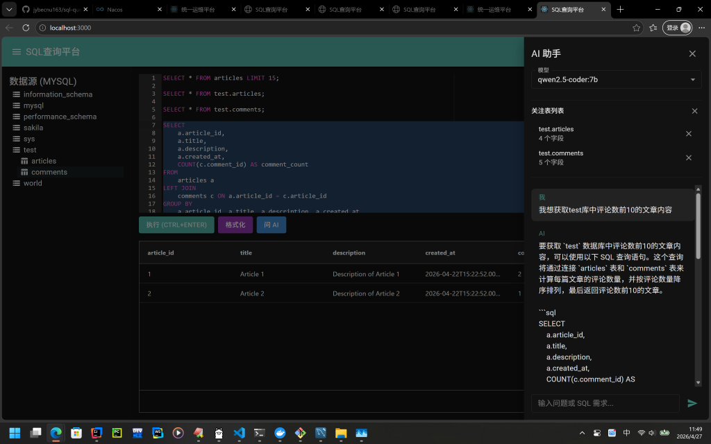

# SQL 查询平台

一个基于 React + Node.js 的 Web SQL 查询工具，支持多标签编辑、语法高亮、数据源浏览、查询结果展示与导出、查询历史记录等功能。

## 技术栈

### 前端
- React 18
- Redux Toolkit（状态管理）
- React Router v6（路由）
- Material-UI（UI 组件）
- Ace Editor（SQL 编辑器）
- AG Grid（数据表格）

### 后端
- Node.js + Express
- REST API（已实现 mysql/Hive，待接入Spark）

## 快速开始

### 1. 生成项目代码

确保已安装 Node.js（v16+），然后：

```bash
git clone https://github.com/jybecnu163/sql-query-platform.git

cd sql-query-platform

### 2. 启动后端
```bash
cd backend
npm install
npm start
```
后端将运行在 http://localhost:3001


### 3. 启动前端
打开新的终端窗口：

```bash
cd frontend
npm install
npm start
```
前端将运行在 http://localhost:3000

### 4. 访问应用
浏览器打开 http://localhost:3000 即可使用。

### 5. 页面展示


### 6.主要功能
✅ 支持mysql和hive查询
✅ 默认显示全库全表，双击表名后自动添加sql语句
✅ 支持当前行和选定代码执行
✅ 支持代码格式化
✅ 结果分页展示


### 7. API 接口
方法	路径	说明
GET	/rest/table/showDatabases/:datasource	获取数据库列表
GET	/rest/table/showTables/:datasource/:database	获取表列表
POST	/rest/query/submit	提交 SQL 执行
GET	/rest/query/result/:queryId	获取查询结果及状态


### 8.项目结构
text
sql-query-platform/
├── backend/                 # Node.js 后端
│   ├── routes/              # API 路由
│   ├── server.js            # 服务入口
│   └── package.json
├── frontend/                # React 前端
│   ├── public/
│   ├── src/
│   │   ├── components/      # 可复用组件
│   │   ├── pages/           # 页面组件
│   │   ├── store/           # Redux 状态管理
│   │   ├── services/        # API 调用封装
│   │   ├── App.js
│   │   └── index.js
│   └── package.json

### 9.开发与扩展
查询页分多tab
数据展示页可排序
数据下载
数据源表字段展示
查询语句或查询页面收藏

### 10.常见问题
Q: 前端执行查询没有结果？
A: 确认后端已启动且 baseURL 配置正确（frontend/src/services/api.js）。

Q: 如何修改默认数据源？
A: 在 frontend/src/store/slices/dataSlice.js 中修改 datasource 的初始值。

Q: 如何支持更多 SQL 语言？
A: // src/components/MainLayout.jsx 中下拉列表并后端新增查询引擎

### 11. 更新
    - 支持本地ollama问答与sql 语句到编写框

### 12. License
MIT