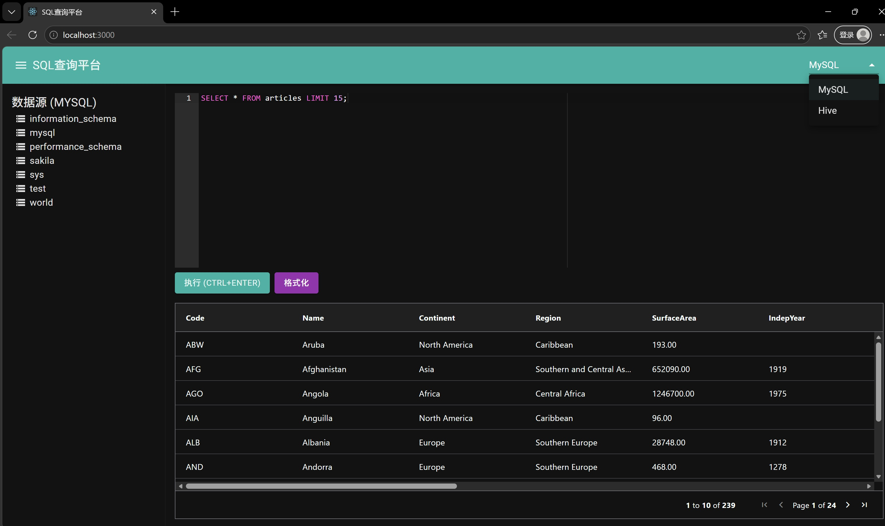

# SQL 查询平台

一个基于 React + Node.js 的 Web SQL 查询工具，支持多标签编辑、语法高亮、数据源浏览、查询结果展示与导出、查询历史记录等功能。

## 技术栈

### 前端
- React 18
- Redux Toolkit（状态管理）
- React Router v6（路由）
- Material-UI（UI 组件）
- Ace Editor（SQL 编辑器）
- AG Grid（数据表格）

### 后端
- Node.js + Express
- 模拟 REST API（可替换为真实 Hive/Spark 引擎调用）

## 快速开始

### 1. 生成项目代码

确保已安装 Node.js（v16+），然后：

```bash
# 创建一个空目录
mkdir sql-query-platform
cd sql-query-platform

# 将生成脚本保存为 generate.js，然后运行
node generate.js

### 2. 启动后端
```bash
cd backend
npm install
npm start
```
后端将运行在 http://localhost:3001


### 3. 启动前端
打开新的终端窗口：

```bash
cd frontend
npm install
npm start
```
前端将运行在 http://localhost:3000

### 4. 访问应用
浏览器打开 http://localhost:3000 即可使用。

### 5. 页面展示


### 6.主要功能
✅ 多标签 SQL 编辑：支持多个查询页面，独立编辑执行。

✅ 语法高亮与自动补全：基于 Ace Editor，支持 MySQL/Hive 语法。

✅ 执行查询：Ctrl+Enter 快捷执行，异步轮询获取结果。

✅ 结果展示：支持分页、排序、筛选，可复制单元格或表头。

✅ 数据源浏览：左侧树形结构展示数据库、表及字段。

✅ 查询历史：查看历史执行记录（后端模拟数据，可扩展）。

✅ SQL 收藏：将常用 SQL 保存到个人文件夹。

### 7. API 接口（后端模拟）
方法	路径	说明
GET	/rest/table/showDatabases/:datasource	获取数据库列表
GET	/rest/table/showTables/:datasource/:database	获取表列表
GET	/rest/table/showColumns/:datasource/:database/:table	获取字段列表
POST	/rest/query/submit	提交 SQL 执行
GET	/rest/query/result/:queryId	获取查询结果及状态
GET	/rest/query/stop/:queryId	停止正在执行的查询
GET	/rest/file/getallfile	获取个人收藏的 SQL 文件
POST	/rest/file/saveonefile	保存 SQL 到收藏夹
GET	/rest/currentUser/avatar	获取用户头像
GET	/rest/enginerole/	获取可用引擎角色
当前后端为模拟数据，实际使用时需替换为真实大数据引擎 API（如 JDBC、Livy 等）。

### 8.项目结构
text
sql-query-platform/
├── backend/                 # Node.js 后端
│   ├── routes/              # API 路由
│   ├── server.js            # 服务入口
│   └── package.json
├── frontend/                # React 前端
│   ├── public/
│   ├── src/
│   │   ├── components/      # 可复用组件
│   │   ├── pages/           # 页面组件
│   │   ├── store/           # Redux 状态管理
│   │   ├── services/        # API 调用封装
│   │   ├── App.js
│   │   └── index.js
│   └── package.json
└── generate.js              # 项目生成脚本

### 9.开发与扩展
替换后端为真实引擎：修改 backend/routes/query.js 中的 /submit 和 /result 接口，调用实际的大数据查询服务。

添加用户认证：后端增加 Session/Cookie 或 JWT 认证，前端携带凭证。

完善收藏夹文件夹树：利用 fancytree 或 MUI TreeView 实现文件拖拽、重命名等功能，参考原始打包文件中的实现。

### 10.常见问题
Q: 前端执行查询没有结果？
A: 确认后端已启动且 baseURL 配置正确（frontend/src/services/api.js）。

Q: 如何修改默认数据源？
A: 在 frontend/src/store/slices/dataSlice.js 中修改 datasource 的初始值。

Q: 如何支持更多 SQL 方言？
A: 修改 Ace Editor 的 mode 属性，例如 mode: "hive"。

### 11. License
MIT